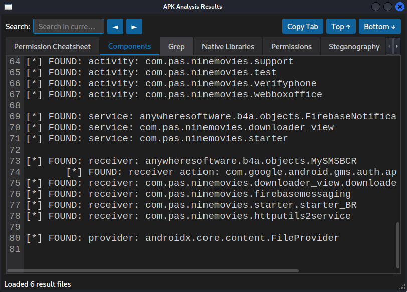
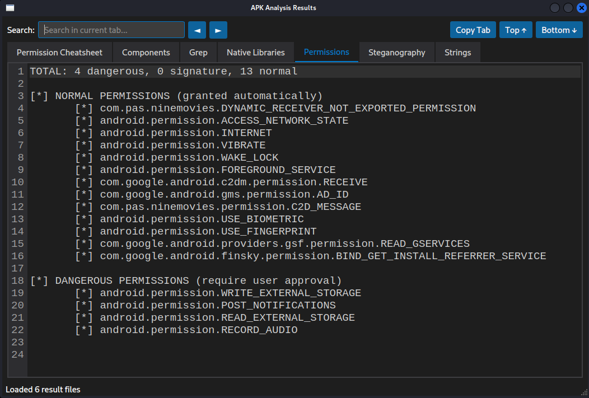
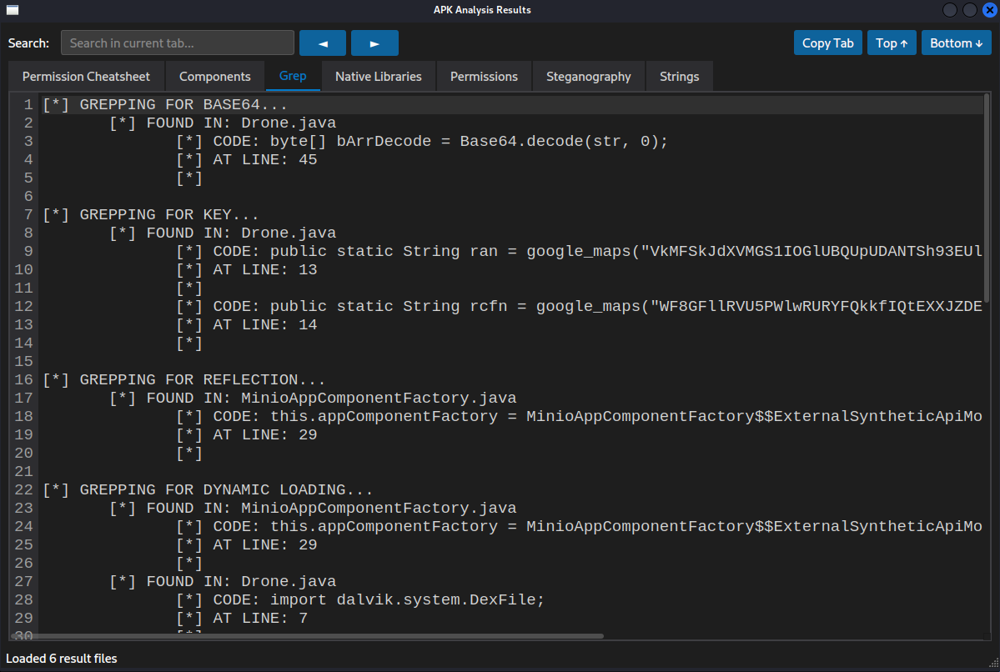
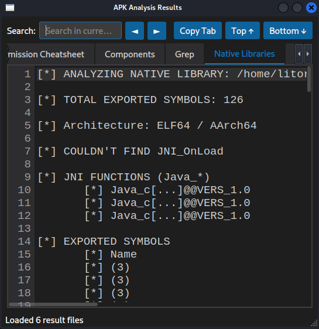
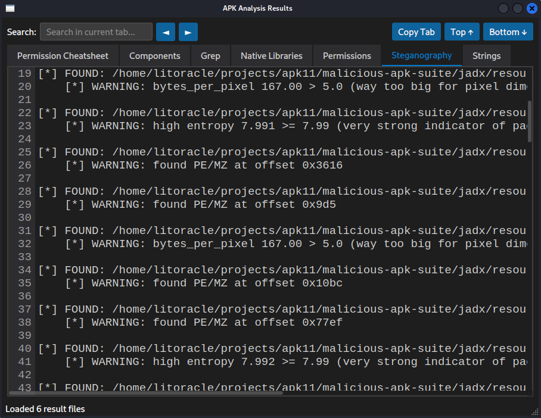
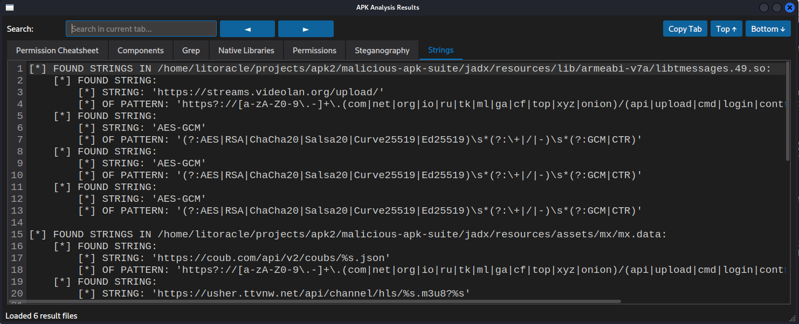

# Malicious APK suite

<br/>

## General overview

**Running on Linux:**

```shell
git clone https://github.com/Kostas-Juskevicius/malicious-apk-suite
cd malicious-apk-suite
cp [your-malicious-apk].apk .

chmod +x malicious_apk_suite.sh
./malicious_apk_suite.sh
```

**What it does**

The shell script starts 6 scripts that return result files displayed in the GUI as 6 tabs:

- `components.py` - parses AndroidManifest.xml for quick and clean extraction of what matters, reducing manual parsing
- `permissions.py` - permissions categorized into normal (implicit access), requiring same signature, and dangerous (explicit user approval)
- `grep.py` - greps the source code output by JADX and returns interesting code categorized by labels, e. g. "crypto", "webview", etc.
- `native_libs.py` - analyzes native libraries present with some quick, simple information such as exported symbols and the presence of JNI_OnLoad
- `steganography.py` - searches for suspicious resources, e. g. image files whose magic bytes don't correspond to the file type, entropy higher than normal, too many bytes per pixel, etc.
- `strings.py` - builds upon the results of steganography, searching for interesting strings within those files

## Components output example



## Permissions output example



## "grep" output example



## Native libraries output example



## Steganography output example



## Strings output example



